# Architecture Overview — bob_nostr

The `bob_nostr` package implements a **containerized Nostr-native AI agent** coordinated over the ROS 2 (Robot Operating System 2) framework. It listens for public mentions (Kind 1) and encrypted direct messages (Kind 1059 / NIP‑17) on the Nostr network, forwards them through an LLM brain for processing, and posts signed replies back to Nostr — all without the brain container ever touching the private key. The system is split across six Docker containers that communicate via HTTP, WebSocket, DDS, and plain TCP.

```mermaid
flowchart TB
    subgraph External["🌐 External World"]
        direction TB
        NRELAYS["Nostr Relays<br/>wss://relay.damus.io, ..."]
        LLM_API["LLM API Provider<br/>(DeepSeek / OpenAI-compatible)"]
        SEARXNG["SearXNG Search<br/>http://192.168.1.10:9080"]
        CRAWL4AI["Crawl4AI Web Scraper<br/>http://192.168.1.10:3020"]
    end

    subgraph Docker["🐳 Docker Compose Stack (nostr-agent)"]
        direction TB

        subgraph Gateway["API Gateway Container"]
            NGINX["nginx:alpine<br/>nostr-api-gate<br/>- Injects API key<br/>- Proxies LLM, Search, Crawl"]
        end

        subgraph Signer["Signer Container"]
            SIGNER["nostr-signer<br/>nostr_signer_service.py<br/>Port 8080<br/>- /public_key<br/>- /sign<br/>- /nip04_encrypt/decrypt<br/>- /nip44_encrypt/decrypt<br/>- /nip17_wrap/unwrap"]
        end

        subgraph Base["Base Container"]
            direction LR
            AGENT_BRAIN["🧠 agent_brain<br/>(bob_llm node)<br/>- LLM context mgmt<br/>- Skill orchestration<br/>- Tool execution"]
            BRIDGE["🌉 nostr_bridge<br/>(nostr_client_node.py)<br/>- Nostr subscribe #p<br/>- GiftWrap unwrap<br/>- Prompt relay"]
            SCHED["⏰ task_scheduler<br/>(APScheduler ROS node)<br/>- Cron / interval jobs<br/>- File-watched task store"]

            BRIDGE -.->|HTTP GET /public_key| SIGNER
            BRIDGE -.->|HTTP POST /nip17_unwrap| SIGNER
            BRIDGE -.->|HTTP POST /nip17_wrap| SIGNER
        end

        subgraph REPL["REPL Container"]
            REPL_NODE["🔒 repl_node<br/>(repl_node.py)<br/>- Isolated Python sandbox<br/>- 15s timeout<br/>- Namespace isolation"]
        end

        subgraph Redis["Redis Container"]
            REDIS_NODE["nostr-redis:6379<br/>- Chronology event log<br/>- Agent contacts store"]
        end

        subgraph Relays["Internal Nostr Relays"]
            RELAY1["nostr-relay-1:8080"]
            RELAY2["nostr-relay-2:8080"]
        end
    end

    subgraph Skills["📂 Skill Scripts (mounted read-only)"]
        CHRONO["chronology<br/>Redis event logging"]
        CONTACTS["agent_contacts<br/>Contact list mgmt"]
        JOURNAL["journal<br/>Periodic journaling"]
        MEMORY["nostr_memory<br/>Memory backup / restore"]
        CODER["core_coder<br/>Code generation"]
        RES["web_researcher<br/>Search & crawl"]
        RELAY_DISC["relay_discovery<br/>Relay scanner"]
        ANN["service_announcement<br/>NIP-89 announce"]
        SCHED_SKILL["task_scheduler<br/>Skill wrapper"]
        REPL_SKILL["repl_kernel<br/>REPL skill wrapper"]
    end

    %% Nostr → Bridge
    NRELAYS <-->|"WebSocket (subscribe #p)"| BRIDGE
    RELAY1 <-->|WebSocket| BRIDGE
    RELAY2 <-->|WebSocket| BRIDGE

    %% Bridge → Agent Brain (ROS 2 Topics)
    BRIDGE -->|"publish /nostr/llm_prompt"| AGENT_BRAIN
    AGENT_BRAIN -->|"publish /nostr/llm_response"| BRIDGE
    AGENT_BRAIN -->|"publish /nostr/llm_stream"| BRIDGE
    AGENT_BRAIN -->|"publish /nostr/llm_reasoning"| BRIDGE
    AGENT_BRAIN -->|"publish /nostr/llm_tool_calls"| BRIDGE
    AGENT_BRAIN -->|"publish /nostr/llm_stats"| BRIDGE

    %% Agent Brain → REPL
    AGENT_BRAIN -->|"publish /nostr/repl/input"| REPL_NODE
    REPL_NODE -->|"publish /nostr/repl/output"| AGENT_BRAIN
    REPL_NODE -->|"publish /nostr/repl/status"| AGENT_BRAIN

    %% Agent Brain → LLM API (via Gateway)
    AGENT_BRAIN -.->|HTTP POST /v1/chat/completions| NGINX
    NGINX -.->|HTTP| LLM_API

    %% Agent Brain → External Tools (via Gateway)
    AGENT_BRAIN -.->|HTTP| NGINX
    NGINX -.->|HTTP| SEARXNG
    NGINX -.->|HTTP| CRAWL4AI

    %% Agent Brain → Skills
    AGENT_BRAIN -->|"execute_skill_script"| Skills

    %% Task Scheduler connections
    SCHED -.->|Shell exec| Skills
    SCHED -->|"publish /nostr/llm_prompt"| AGENT_BRAIN

    %% Redis connections
    CHRONO <-->|Redis protocol| REDIS_NODE
    CONTACTS <-->|Redis protocol| REDIS_NODE

    %% Styling
    classDef container fill:#1a1a2e,stroke:#e94560,stroke-width:2px,color:#fff;
    classDef node fill:#16213e,stroke:#0f3460,stroke-width:2px,color:#ddd;
    classDef external fill:#2d2d2d,stroke:#666,stroke-width:1px,color:#aaa;
    classDef skill fill:#1a3a2a,stroke:#2ecc71,stroke-width:1px,color:#ccc;
    classDef topic fill:#3a1a1a,stroke:#e67e22,stroke-width:1px,color:#ccc;
    classDef gateway fill:#1a2a3a,stroke:#3498db,stroke-width:2px,color:#ddd;

    class Gateway,Signer,Base,REPL,Redis,Relays container;
    class AGENT_BRAIN,BRIDGE,SCHED,REPL_NODE node;
    class NRELAYS,LLM_API,SEARXNG,CRAWL4AI external;
    class CHRONO,CONTACTS,JOURNAL,MEMORY,CODER,RES,RELAY_DISC,ANN,SCHED_SKILL,REPL_SKILL skill;
```

## Component Description

| Container | Role |
|-----------|------|
| **base** | Runs three ROS 2 nodes: `agent_brain` (LLM orchestration, skill/tool execution), `nostr_bridge` (Nostr relay subscription, event unwrapping, reply posting), and `task_scheduler` (APScheduler-based cron/interval/date jobs). The private key is explicitly blocked via a `/dev/null` bind‑mount of `.env.signer`. |
| **signer** | Cryptographically isolated HTTP service that holds the `NOSTR_AGENT_SECRET`. Exposes endpoints for signing, NIP‑04/NIP‑44 encrypt/decrypt, and NIP‑17 Gift Wrap/unwrap. The base container talks to it over HTTP but never has access to the raw key. |
| **api-gateway** | nginx reverse‑proxy that injects the `UPSTREAM_API_KEY` into requests to the LLM provider, SearXNG, and Crawl4AI. Keeps secret material out of the agent container. |
| **repl** | Hardened Python REPL sandbox with a 15‑second execution timeout and isolated namespace. Receives code snippets from `agent_brain` via the `/nostr/repl/input` topic. |
| **redis** | In‑memory data store used by the `chronology` skill (event logging) and the `agent_contacts` skill (persistent contact list). |
| **nostr-relay‑1 / nostr‑relay‑2** | Internal Nostr relay instances for low‑latency, local event exchange before events fan out to external relays. |

## Key ROS 2 Topics

All topics are scoped under the configurable `ROS_NAMESPACE` (default `/nostr`).

| Topic | Direction | Description |
|-------|-----------|-------------|
| `/nostr/llm_prompt` | nostr_bridge → agent_brain | User prompt extracted from a Nostr event |
| `/nostr/llm_response` | agent_brain → nostr_bridge | Final complete text to post as a reply |
| `/nostr/llm_stream` | agent_brain → nostr_bridge | Token‑by‑token streaming chunks |
| `/nostr/llm_reasoning` | agent_brain → nostr_bridge | Reasoning/thinking trace (e.g. DeepSeek‑R1) |
| `/nostr/llm_tool_calls` | agent_brain → nostr_bridge | JSON tool‑call metadata for observability |
| `/nostr/llm_stats` | agent_brain → nostr_bridge | Token counts, generation speed, model info |
| `/nostr/repl/input` | agent_brain → repl | Python code snippet to execute in sandbox |
| `/nostr/repl/output` | repl → agent_brain | stdout/stderr result or traceback |
| `/nostr/repl/status` | repl → agent_brain | Periodic REPL session metadata heartbeat |

## Data Flow (End‑to‑End)

1. **Subscription** — [`nostr_bridge`](ros2_ws/src/bob_nostr/bob_nostr/nostr_client_node.py:182) subscribes to Kind 1 (mentions) and Kind 1059 (Gift Wraps) on all configured relays using a `#p` tag filter matching the agent's public key.
2. **Ingress** — Incoming events are handled by [`handle_incoming_event()`](ros2_ws/src/bob_nostr/bob_nostr/nostr_client_node.py:218). Gift Wraps are unwrapped via HTTP `POST /nip17_unwrap` to the signer; old events (before node start) are discarded.
3. **Prompt** — The extracted content is published to `/nostr/llm_prompt` as a `std_msgs/msg/String`.
4. **Processing** — [`agent_brain`](ros2_ws/src/bob_nostr/launch/base_launch.yaml:8) (the `bob_llm` node) builds a conversation context, loads the configured skills, calls the LLM API through the gateway, and executes any tool/skill invocations.
5. **Egress** — The final response is published to `/nostr/llm_response`. [`send_nostr_reply()`](ros2_ws/src/bob_nostr/bob_nostr/nostr_client_node.py:342) wraps it as a Gift Wrap (via `POST /nip17_wrap` to the signer) for DMs, or as a signed Kind 1 mention, then broadcasts it to all relays.
